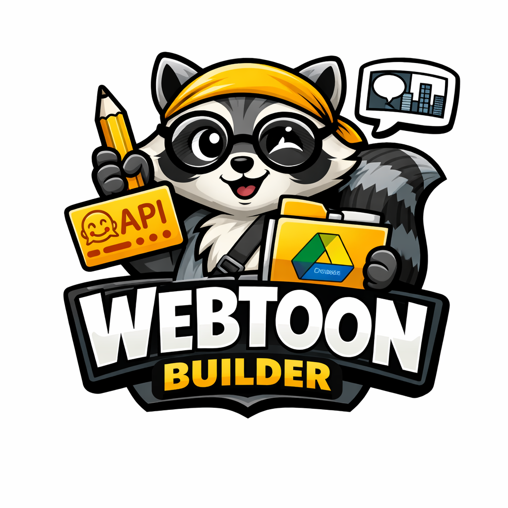

# Webtoon Maker 🎨

> Créez vos webtoons directement dans votre navigateur, hébergé sur GitHub Pages.



**[▶ Ouvrir l'application](https://archlord12345.github.io/PROJET-WEBTOON/)**

---

## ✨ Fonctionnalités

| Fonctionnalité | Description |
|---|---|
| 🤖 Génération IA | Génère des images à partir de texte via l'API Hugging Face Inference (FLUX, SDXL, SD 1.5…) |
| 📁 Google Drive | Sauvegarde et chargement des projets sur votre Google Drive personnel |
| 🖼 Éditeur de panneaux | Ajout, duplication, suppression et réorganisation des panneaux par glisser-déposer |
| ✏ Texte / Dialogue | Ajout de légendes positionnées (haut, bas, superposé) sur chaque panneau |
| 📐 Mise en page | Panneaux pleine largeur, demi-largeur ou tiers ; espacement et couleur de fond configurables |
| 📥 Import image | Import local (glisser-déposer) ou par URL |
| ⬇ Export | PNG long, PDF ou fichier projet JSON |
| ⌨ Raccourcis | `Ctrl+S` (sauvegarde Drive), `Ctrl+N` (nouveau panneau), `Échap` (ferme les modales) |

---

## 🚀 Démarrage rapide

### 1. Clé API Hugging Face

1. Créez un compte sur [huggingface.co](https://huggingface.co)
2. Allez dans **Settings → Access Tokens → New token** (type `read` suffit)
3. Copiez votre token `hf_xxxxxxxxxx`
4. Dans l'app, cliquez sur **⚙ Paramètres** et collez votre clé

### 2. Google Drive (optionnel)

> Nécessaire uniquement pour la sauvegarde cloud.

1. Ouvrez la [Google Cloud Console](https://console.cloud.google.com/)
2. Créez un projet → Activez **Google Drive API**
3. **APIs & Services → Credentials → Create OAuth 2.0 Client ID**
   - Type : **Web application**
   - Origines autorisées : `https://archlord12345.github.io`
   - URIs de redirection : `https://archlord12345.github.io/PROJET-WEBTOON/`
4. Copiez le **Client ID** (`.apps.googleusercontent.com`)
5. Dans l'app → **⚙ Paramètres → Google Drive** → collez l'ID → **Connecter**

### 3. Créer votre premier webtoon

1. Cliquez sur **＋ Ajouter un panneau**
2. Entrez un prompt descriptif dans l'éditeur (ex : *"Un samouraï debout sous la pluie, style manga encre noire"*)
3. Choisissez un **style rapide** et un **modèle**
4. Cliquez sur **🎨 Générer l'image**
5. Ajoutez un dialogue, répétez, puis **⬇ Exporter** !

---

## 🗂 Structure du projet

```
PROJET-WEBTOON/
├── index.html          # Application principale (SPA)
├── css/
│   └── style.css       # Thème sombre, layout, composants UI
├── js/
│   ├── app.js          # Logique applicative (état, rendu, événements)
│   ├── huggingface.js  # Client API Hugging Face Inference
│   └── gdrive.js       # Client Google Drive (OAuth2 GIS + REST API v3)
├── assets/
│   └── mascot.svg      # Mascotte (remplaçable par votre propre image)
├── _config.yml         # Config GitHub Pages
└── README.md
```

---

## 🔧 Hébergement GitHub Pages

Le projet est une SPA statique (HTML/CSS/JS pur), aucun backend requis.

1. Dans les **Settings** du dépôt → **Pages**
2. Source : **Deploy from a branch** → branche `main` → dossier `/ (root)`
3. Enregistrez — l'app sera disponible sur `https://archlord12345.github.io/PROJET-WEBTOON/`

---

## 🔒 Sécurité

- La clé API Hugging Face est stockée **uniquement dans `localStorage`** de votre navigateur.
- Le token Google Drive n'est **jamais** envoyé à un tiers ; il expire automatiquement.
- Aucun serveur intermédiaire : tout passe directement entre votre navigateur et les APIs.

---

## 📄 Licence

MIT — libre d'utilisation, de modification et de distribution.
